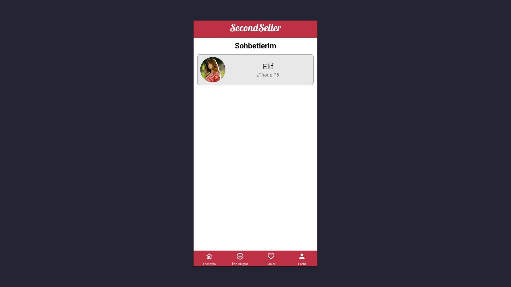
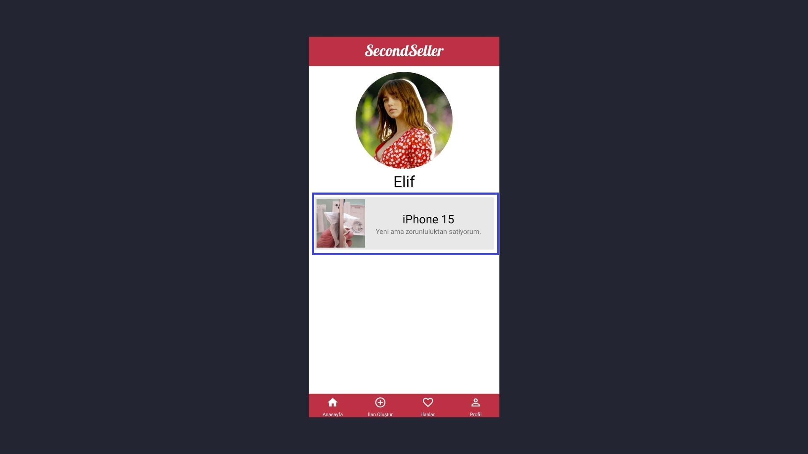

Proje geliştirmede **ReactNative** framework'ü kullanıldı. 
Figma tasarımına [bu linkten](https://www.figma.com/design/CNnsShKFEWdjxSbSwZ3yR6/SecondSeller?node-id=0-1&t=IVpOpLfNFZ7PWeKo-1) ulaşabilirsiniz.

## Zekeriya Dönmez Tasarımları

1. Kayıt Olma Sayfası (Register)
2. İlan Paylaşma ve Güncelleme Sayfası (CreateAndUpdateAdvertisement)
3. Ana Sayfa (Home)
4. Ana Sayfa Filtreleme Ekranı (Home/FilterModal)
5. Farklı Kullanıcıların İlanları Sayfası (OwnerProfile)

## Selin Aydemir Tasarımları

1. İlan Detay Sayfası Teklif Ver Ekranı (AdvertisementDetail/OfferModal)
2. Favoriler Sayfası (OwnFavoriteAdvertisements)
3. Favoriler Sayfası İlan Kartları (OwnFavoriteAdvertisements / Advertisement)
4. Sohbet Ekranı Hızlı Mesaj Alanı (Chat/FastMessageChips)

## İsmail Kaya Tasarımları

1. Giriş Yapma Sayfası (Login)
2. Profil Sayfası (Profile)
3. İlan Detay Sayfası (AdvertisementDetail)
4. İlan Detay Sayfası Tam Ekran Resim (AdvertismentDetail/FullScreenImageModal)

## Alper Avcı Tasarımları

1. Sohbet Sayfası (Chat)  
   
2. Şifre Değiştirme Sayfası (Profile/ChangePassword)  
   
3. Sohbet Odaları (Profile/Messages)  
   
4. Profil Güncelleme (Profile Edit)  
   
5. Farklı Kullanıcı İlanları İlan Kartı (OwnerProfile/AdvertisementCard)  
   

## Kamil Özdemir Tasarımları

1. Sohbet Mesaj Alanı (Chat/ChatInput)
2. Şifremi Unuttum Sayfası (Forgot)
3. Şifre Değiştirme Sayfası (Forgot/UpdatePassword)
4. Eposta Doğrulama Sayfası (EmailVerification)
