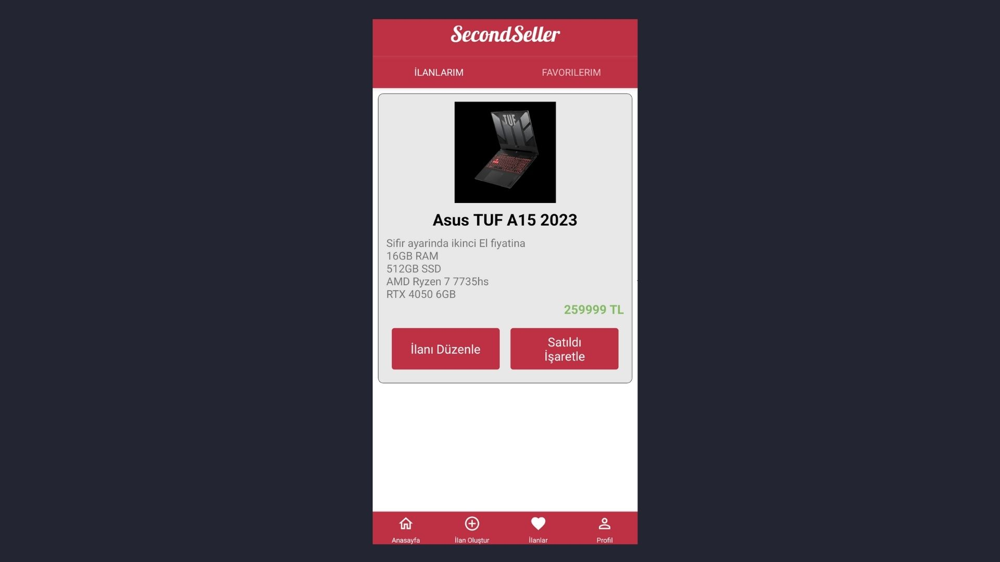
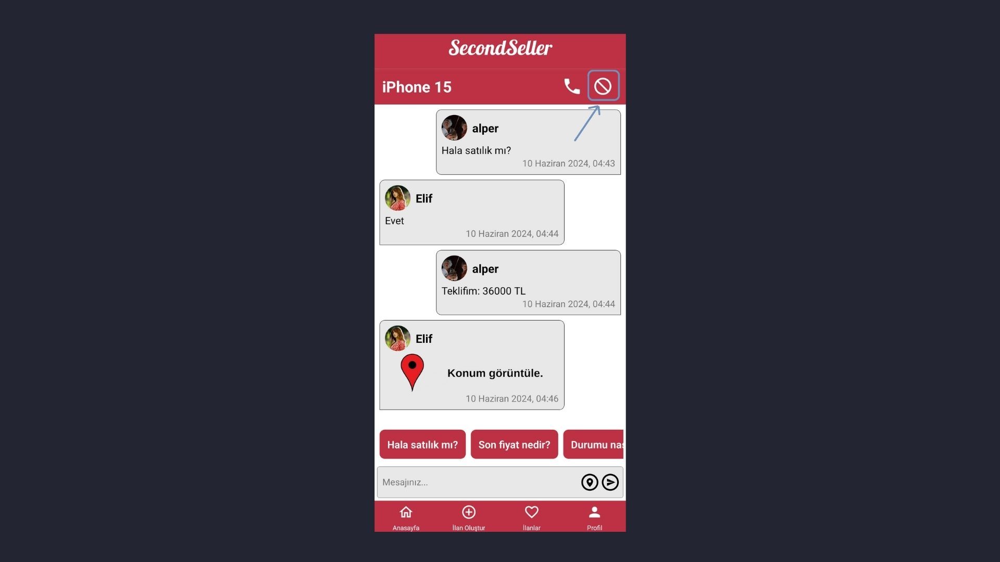
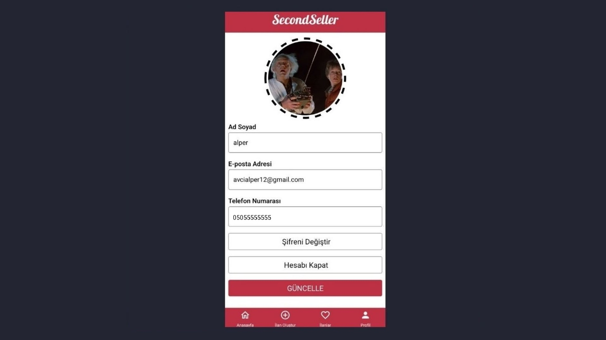
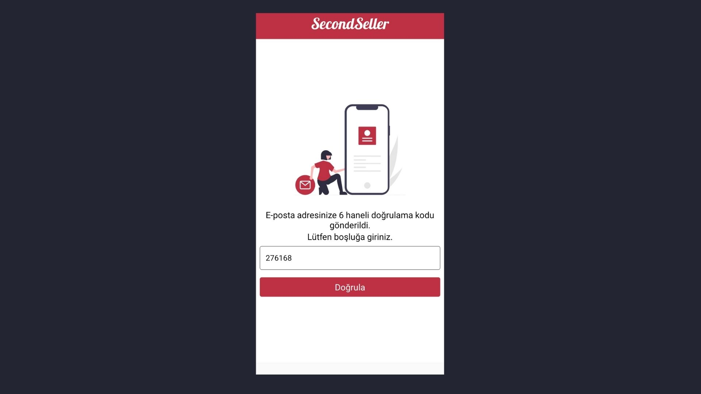
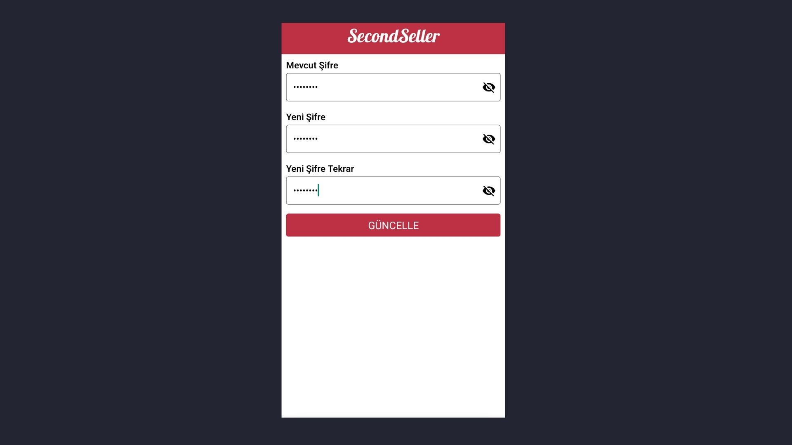
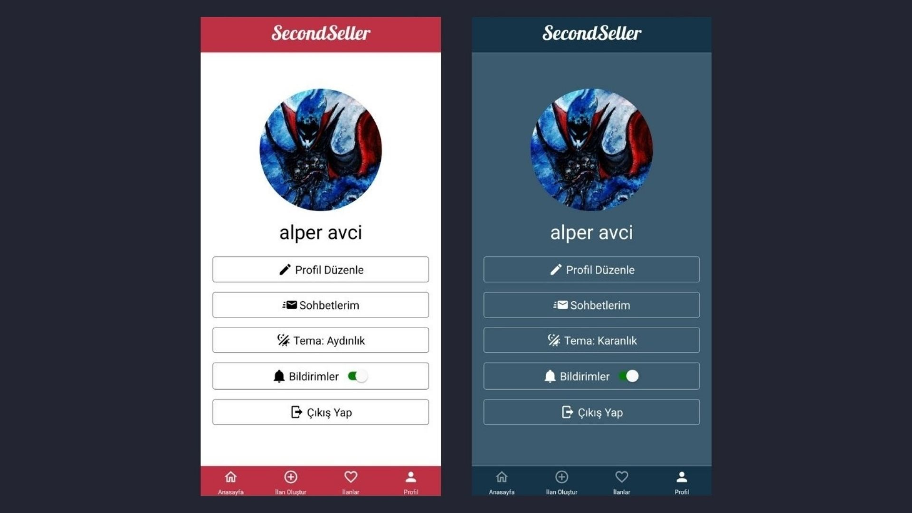
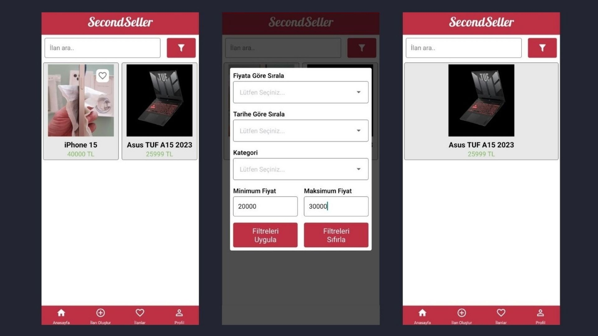

Proje geliştirmede **ReactNative** framework'ü kullanıldı. 
Figma tasarımına [bu linkten](https://www.figma.com/design/CNnsShKFEWdjxSbSwZ3yR6/SecondSeller?node-id=0-1&t=IVpOpLfNFZ7PWeKo-1) ulaşabilirsiniz.

# Zekeriya

- Kayıt olma
- İlan paylaşılması
- İlan bilgilerinin görüntülenmesi
- Profil görüntüleme
- Favorilere ekleme
- Fiyata göre filtreleme (artan / azalan)

# Selin Aydemir

- Fiyat teklifi gönderme
- Favorilerin listelenmesi
- Arama yapma
- İlanı silme
- İlanın satıldı olarak işaretlenmesi
- Otomatik mesaj

# İsmail Kaya

- Giriş yapma
- Favorilerden kaldırma
- İlan düzenleme
- İlan arama yapma
- Bildirim ayarları
- Tarihe göre filtreleme

# Alper Avcı

- Yazılı sohbet  
  
- Paylaşılan ilanların görüntülenmesi  
  
- Engelleme  
  
- Profil düzenleme  
    
    
  
- Koyu & Açık Tema  
  
- Fiyat aralığına göre filtreleme  
  

# Kamil Özdemir

- Hesap silme
- Konum paylaşma
- Çıkış yapma
- Şifremi unuttum
- İlanın konumunun görüntülenmesi
- Kategoriye göre filtreleme
