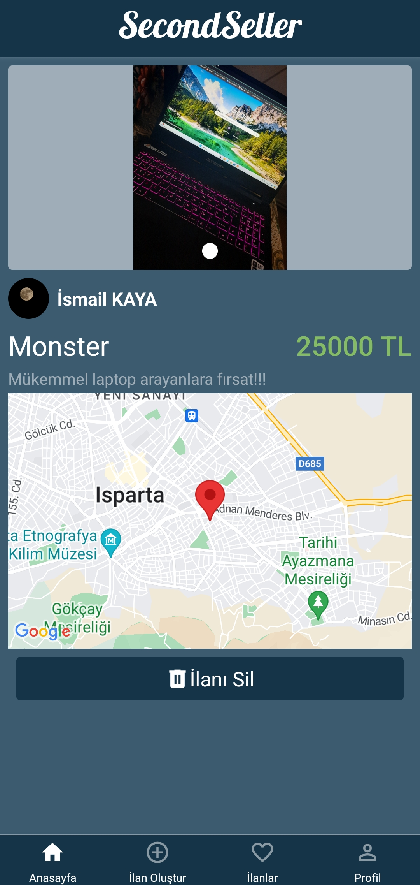

Proje geliştirmede **ReactNative** framework'ü kullanıldı. 
Figma tasarımına [bu linkten](https://www.figma.com/design/CNnsShKFEWdjxSbSwZ3yR6/SecondSeller?node-id=0-1&t=IVpOpLfNFZ7PWeKo-1) ulaşabilirsiniz.

## Zekeriya Dönmez Tasarımları

1. Kayıt Olma Sayfası (Register)  
   

2. İlan Paylaşma ve Güncelleme Sayfası (CreateAndUpdateAdvertisement)  
   
   

3. Ana Sayfa (Home)  
   

4. Ana Sayfa Filtreleme Ekranı (Home/FilterModal)  
   

5. Farklı Kullanıcıların İlanları Sayfası (OwnerProfile)  
   

## Selin Aydemir Tasarımları

1. İlan Detay Sayfası Teklif Ver Ekranı (AdvertisementDetail/OfferModal)  
   

2. Favoriler Sayfası (OwnFavoriteAdvertisements)  
   

3. Favoriler Sayfası İlan Kartları (OwnFavoriteAdvertisements / Advertisement)  
   

4. Sohbet Ekranı Hızlı Mesaj Alanı (Chat/FastMessageChips)  
   

## İsmail Kaya Tasarımları

1. Giriş Yapma Sayfası (Login) 
   
2. Profil Sayfası (Profile) 
   
3. İlan Detay Sayfası (AdvertisementDetail) 
   
4. İlan Detay Sayfası Tam Ekran Resim (AdvertismentDetail/FullScreenImageModal) 
   

## Alper Avcı Tasarımları

1. Sohbet Sayfası (Chat)  
   
2. Şifre Değiştirme Sayfası (Profile/ChangePassword)  
   
3. Sohbet Odaları (Profile/Messages)  
   
4. Profil Güncelleme (Profile/ProfileEdit)  
   
5. Farklı Kullanıcı İlanları İlan Kartı (OwnerProfile/AdvertisementCard)  
   

## Kamil Özdemir Tasarımları

1. Sohbet Mesaj Alanı (Chat/ChatInput)  
    
2. Şifremi Unuttum Sayfası (Forgot)  
    
3. Şifre Değiştirme Sayfası (Forgot/UpdatePassword)  
 
4. Eposta Doğrulama Sayfası (EmailVerification)  
 
 
